##Analyzing _Cyclistic_ 12 month user data with MySQL with Tableau dashboard visualization

In this project, I will be using the Cyclistic’s historical trip dataset to analyze and identify trends. I will also be using what I have learned in Google Data Analytics course by applying the data analysis process or case study roadmap I called **‘APPASA’** whereby the acronym stands for:

**A**: Ask  
**P**: Prepare  
**P**: Process  
**A**: Analyze  
**S**: Share  
**A**: Act

I will proceed with the first step, as it is very important to ask questions before you even touch the data. Defining a problem and focusing on it throughout the whole data analysis process is very important, as one might easily stray away.
Let’s move on to the first step:

####Case Study Roadmap 1: _ASK_

Key business task: Understanding how casual riders and annual members use Cyclistic bikes differently. From these insights, design a new marketing strategy to convert casual members into annual members.

Relate the objectives to our questions and you may have questions below:
1.	How do annual members and casual riders use Cyclistic bikes differently?
 * Determine the type of bike used by casual and member rider 
 * Determine the most frequent starting and ending stations appear
 * Determine the time taken for each ride by casual and member rider
2.	Why would casual riders buy Cyclistic annual membership?
  * Determining the 'why' is crucial as it helps us understand the pattern usage of casual riders based on the challenges, lack of ease of accessibility from the questions risen above.
3.	How can Cyclistic use digital media to influence casual riders to become members?   
 * There needs to be a hypothesis that suggest what, where, how, when a campaign must be launched to target the casual riders, relating back to the questions.

####Case Study Roadmap 2: _PREPARE_

Cyclistic is a fictional company however datasets are still appropriate and has been made available by Motivate International Inc. under the license found in this website https://ride.divvybikes.com/data-license-agreement. In this website, the public data can be used to explore how different customer types are using Cyclistic bikes.
The data can be found from website https://divvy-tripdata.s3.amazonaws.com/index.html. Previous 12 months of Cyclistic trip data are chosen due remain relevancy to the current trends. There are total of 12 sets of data/excel files with each file representing 1 month of data collected.

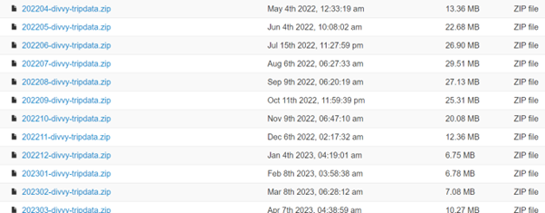

Upon looking at one example of the datasets in excel sheet, the data are organized with a few columns classified by the type of ride, starting and ending time & stations with its ID, type of member (casual/member). Each ride also has a unique ID. The same format is applicable to all 12 month’s files.

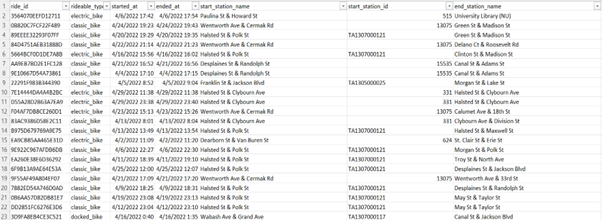

Now, it is important that the data has to be ROCCC: Reliable, Original, Comprehensive, Current and Cited. The data is original and reliable since it is already licensed as mentioned above. The data is also comprehensive as it has unique ride_ID representing each ride data that is captured. Finally, it is current data that is recorded periodically from Apr 2022 – Mar 2023.

####Case Study Roadmap 3: _PROCESS_
Since the data in one single file contains 300k+ rows with each row representing the details of one single ride recorded, the data size is very big and is strongly recommended to be processed with SQL. 
Hence in this case, I will be using MySQL. For visualization part, I will use Tableau.
This phase would be focusing and documenting how I clean my data with SQL.
First, in MySQL I create a new database named ‘Capstone’. This would be where I store all my 12 month’s datasets. Next, before I import my excel data into MySQL server, I change the format by re-saving the file from .csv file to .xlsx file (Excel workbook).  Below is the standard format downloaded which is csv. file.

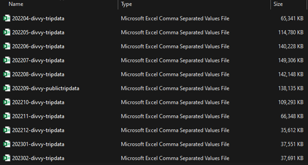

Then, go back to MySQL and import April 22’s bike data ‘202204-divvy-tripdata’ into ‘Capstone’ database. We will import 1 month’s data first to see how each column are able to contribute to our business task, then only we sort, filter and clean the data the way we would like to see.

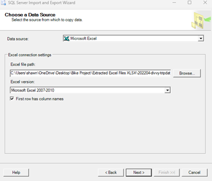
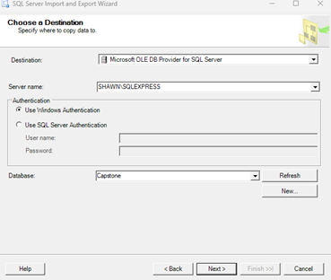
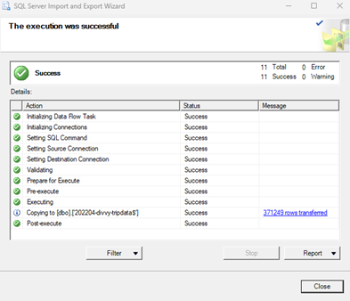

Now, the data has been imported. We will start to look at the dataset by checking Top1000 rows for our analysis.

>/****** Script for SelectTopNRows command from SSMS  ******/  
SELECT TOP (1000)  
       [ride_id]  
      ,[rideable_type]  
      ,[started_at]  
      ,[ended_at]  
      ,[start_station_name]  
      ,[start_station_id]  
      ,[end_station_name]  
      ,[end_station_id]  
      ,[start_lat]  
      ,[start_lng]  
      ,[end_lat]  
      ,[end_lng]  
      ,[member_casual]  
  FROM [Capstone].[dbo].['202204-divvy-tripdata$']
  
  We shall identify the actual meaning of each columns and keys. We will run our first query as clarification.
  
  **ride_id** = Represents the unique ID for each users 
  
  The next code will shows the dataset which will help us identify what are the data to utilized, filter, sort and clean

> SELECT *  
 FROM Capstone..Apr2022Data

We shall identify the actual meaning of each columns and keys. We will run our first query as clarification.

> SELECT  
COUNT(DISTINCT ride_id), COUNT(ride_id)  
  FROM Capstone..Apr2022Data

As we obtain the same number for both columns, it means that **ride_id** is our primary key.

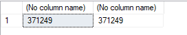

Since we have 12 tables representing data from 12 months ago, we would like to merge those data. Using **UNION ALL** statement will join these tables together.

> DROP TABLE if exists ONEYEARDATA  
CREATE TABLE ONEYEARDATA  
(  
       ride_id nvarchar(255)  
	  ,rideable_type nvarchar(255)  
      ,[started_at] datetime  
      ,[ended_at] datetime  
      ,[start_station_name] nvarchar(255)  
      ,[start_station_id] nvarchar(255)  
      ,[end_station_name] nvarchar(255)  
      ,[end_station_id] nvarchar(255)  
      ,[start_lat] float  
      ,[start_lng] float  
      ,[end_lat] float  
      ,[end_lng] float  
      ,[member_casual] nvarchar(255)  
)  

>DROP TABLE if exists ONEYEARDATA  
CREATE TABLE ONEYEARDATA  
(  
       ride_id nvarchar(255)  
	  ,rideable_type nvarchar(255)  
      ,[started_at] datetime  
      ,[ended_at] datetime  
      ,[start_station_name] nvarchar(255)  
      ,[start_station_id] nvarchar(255)  
      ,[end_station_name] nvarchar(255)  
      ,[end_station_id] nvarchar(255)  
      ,[start_lat] float  
      ,[start_lng] float  
      ,[end_lat] float  
      ,[end_lng] float  
      ,[member_casual] nvarchar(255)  
)  

>INSERT INTO ONEYEARDATA  
SELECT [ride_id],[rideable_type]  
      ,[started_at]  
      ,[ended_at]
      ,[start_station_name]  
      ,[start_station_id]  
      ,[end_station_name]  
      ,[end_station_id]  
      ,[start_lat]  
      ,[start_lng]  
      ,[end_lat]  
      ,[end_lng]  
      ,[member_casual]   
FROM Capstone..Apr2022Data  
UNION ALL  

>SELECT [ride_id],[rideable_type]  
      ,[started_at]  
      ,[ended_at]
      ,[start_station_name]  
      ,[start_station_id]  
      ,[end_station_name]  
      ,[end_station_id]  
      ,[start_lat]  
      ,[start_lng]  
      ,[end_lat]  
      ,[end_lng]  
      ,[member_casual]   
FROM Capstone..May2022Data  
UNION ALL  

>SELECT [ride_id],[rideable_type]  
      ,[started_at]  
      ,[ended_at]
      ,[start_station_name]  
      ,[start_station_id]  
      ,[end_station_name]  
      ,[end_station_id]  
      ,[start_lat]  
      ,[start_lng]  
      ,[end_lat]  
      ,[end_lng]  
      ,[member_casual]   
FROM Capstone..June2022Data  
UNION ALL  

>SELECT [ride_id],[rideable_type]  
      ,[started_at]  
      ,[ended_at]
      ,[start_station_name]  
      ,[start_station_id]  
      ,[end_station_name]  
      ,[end_station_id]  
      ,[start_lat]  
      ,[start_lng]  
      ,[end_lat]  
      ,[end_lng]  
      ,[member_casual]   
FROM Capstone..July2022Data  
UNION ALL  

>SELECT [ride_id],[rideable_type]  
      ,[started_at]  
      ,[ended_at]
      ,[start_station_name]  
      ,[start_station_id]  
      ,[end_station_name]  
      ,[end_station_id]  
      ,[start_lat]  
      ,[start_lng]  
      ,[end_lat]  
      ,[end_lng]  
      ,[member_casual]   
FROM Capstone..August2022Data  
UNION ALL   

>SELECT [ride_id],[rideable_type]  
      ,[started_at]  
      ,[ended_at]
      ,[start_station_name]  
      ,[start_station_id]  
      ,[end_station_name]  
      ,[end_station_id]  
      ,[start_lat]  
      ,[start_lng]  
      ,[end_lat]  
      ,[end_lng]  
      ,[member_casual]   
FROM Capstone..September2022Data  
UNION ALL  

>SELECT [ride_id],[rideable_type]  
      ,[started_at]  
      ,[ended_at]
      ,[start_station_name]  
      ,[start_station_id]  
      ,[end_station_name]  
      ,[end_station_id]  
      ,[start_lat]  
      ,[start_lng]  
      ,[end_lat]  
      ,[end_lng]  
      ,[member_casual]   
FROM Capstone..October2022Data  
UNION ALL  

>SELECT [ride_id],[rideable_type]  
      ,[started_at]  
      ,[ended_at]
      ,[start_station_name]  
      ,[start_station_id]  
      ,[end_station_name]  
      ,[end_station_id]  
      ,[start_lat]  
      ,[start_lng]  
      ,[end_lat]  
      ,[end_lng]  
      ,[member_casual]   
FROM Capstone..November2022Data  
UNION ALL  

>SELECT [ride_id],[rideable_type]  
      ,[started_at]  
      ,[ended_at]
      ,[start_station_name]  
      ,[start_station_id]  
      ,[end_station_name]  
      ,[end_station_id]  
      ,[start_lat]  
      ,[start_lng]  
      ,[end_lat]  
      ,[end_lng]  
      ,[member_casual]   
FROM Capstone..December2022Data  
UNION ALL  

>SELECT [ride_id],[rideable_type]  
      ,[started_at]  
      ,[ended_at]
      ,[start_station_name]  
      ,[start_station_id]  
      ,[end_station_name]  
      ,[end_station_id]  
      ,[start_lat]  
      ,[start_lng]  
      ,[end_lat]  
      ,[end_lng]  
      ,[member_casual]   
FROM Capstone..Jan2023Data  
UNION ALL  

>SELECT [ride_id],[rideable_type]  
      ,[started_at]  
      ,[ended_at]
      ,[start_station_name]  
      ,[start_station_id]  
      ,[end_station_name]  
      ,[end_station_id]  
      ,[start_lat]  
      ,[start_lng]  
      ,[end_lat]  
      ,[end_lng]  
      ,[member_casual]   
FROM Capstone..Feb2023Data  
UNION ALL  

>SELECT [ride_id],[rideable_type]  
      ,[started_at]  
      ,[ended_at]
      ,[start_station_name]  
      ,[start_station_id]  
      ,[end_station_name]  
      ,[end_station_id]  
      ,[start_lat]  
      ,[start_lng]  
      ,[end_lat]  
      ,[end_lng]  
      ,[member_casual]   
FROM Capstone..Mar2023Data; 

As there is an error returning _"Error converting data type nvarchar to float"_, troubleshooting the columns string format is needed. Turns out that some of the columns are in **'float'** format, hence we need to reconvert back to **'nvarchar'**.

>ALTER TABLE Capstone..Apr2022Data  
ALTER COLUMN start_station_id NVARCHAR(255) 

>ALTER TABLE Capstone..July2022Data  
ALTER COLUMN start_station_id NVARCHAR(255)

>ALTER TABLE Capstone..September2022Data  
ALTER COLUMN end_station_id NVARCHAR(255) 

>ALTER TABLE Capstone..October2022Data  
ALTER COLUMN start_station_id NVARCHAR(255)

>ALTER TABLE Capstone..November2022Data  
ALTER COLUMN start_station_id NVARCHAR(255)  
ALTER TABLE Capstone..November2022Data  
ALTER COLUMN end_station_id NVARCHAR(255)

>ALTER TABLE Capstone..December2022Data  
ALTER COLUMN end_station_id NVARCHAR(255)

>ALTER TABLE Capstone..Mar2023Data  
ALTER COLUMN start_station_id NVARCHAR(255)

Rerun **UNION ALL** again to create a new table with **5,803,720** rows of data. 

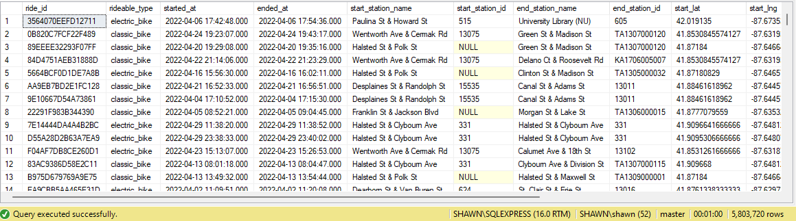

####Case Study Roadmap 4: _ANALYZE_

Now, start to dig into data by using 'DATEDIFF' which calculates the duration per every bike trip in seconds. Upload this data into the temp table

>ALTER TABLE ONEYEARDATA  
ADD ride_length float

>SELECT  
	ride_id,  
	started_at,  
	ended_at,  
	DATEDIFF(second,started_at,ended_at) AS duration  
FROM ONEYEARDATA  

>UPDATE ONEYEARDATA  
SET ride_length = DATEDIFF(second,started_at,ended_at)  

Next, we try to obtain the average ride length duration in seconds to determine the usage pattern among users. We also determine the max value of ride length, which means the longest trip one has ever made in this 12 months recorderd period.

>SELECT AVG(ride_length) AS avg_ride_length,   
	   MAX(ride_length) AS max_ride_length    
FROM ONEYEARDATA  

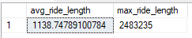

The **average** ride length is **1139 seconds (equivalent to 19 minutes)**.  

The **max** ride length is **2,483,235 seconds (equivalent to 41,387 minutes or 690 hours)**.

From the max ride length of **690hours**, it is possible that there could be an anomaly in the data, hence further cleaning is required. We try to check if it is possible to have trips that are longer than **10 days (14,400 minutes)**.

>SELECT *  
FROM ONEYEARDATA  
WHERE ride_length > 14400  
ORDER BY ride_length DESC  

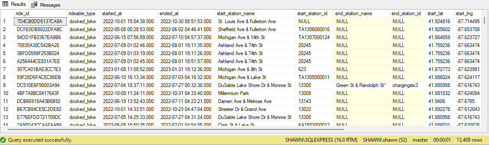

Turns out, there are alot of **docked_bikes** in this range of **ride_length** from the glance of it, hence we can assume **docked bikes** are a valid choice for users who stay at a certain location for a **longer period of time**. There is no anamoly on this data.

Next, we look at the average usage pattern of casual vs members comparing to the average ride length of **19minutes**.

>SELECT DISTINCT(member_casual), COUNT(member_casual) AS number, AVG(ride_length) AS avg_ride_length  
FROM ONEYEARDATA  
GROUP BY member_casual 

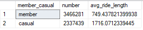

Despite that there are more members than casual riders, there is a solid evidence that 'casual' indeed uses the bike longer than 'members', and that is why we should promote membership to casual so they can enjoy the benefits.

Next, let's convert the start & end days to **Day** column, so we may determine more pattern and trend of users.

>ALTER TABLE ONEYEARDATA  
ADD Start_Day varchar(255)  

>UPDATE ONEYEARDATA  
SET Start_Day = FORMAT(CAST(started_at AS DATE), 'ddd') 

>ALTER TABLE ONEYEARDATA  
ADD End_Day varchar(255)  

>UPDATE ONEYEARDATA  
SET End_Day = FORMAT(CAST(ended_at AS DATE), 'ddd')   

>SELECT Start_Day, member_casual, COUNT(member_casual) as num  
FROM ONEYEARDATA  
GROUP BY Start_Day, member_casual  
ORDER BY num DESC 

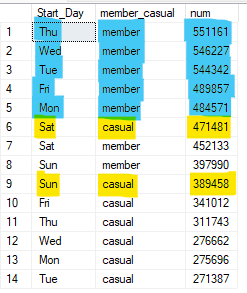

From this finding, we can see that **member mostly commute during weekdays**, with the assumption that due to work, they sign up for membership.

Whereas highest number of **casual users can be seen using on weekends**, in fact **Sat casual users** > **Sat member users**.

From this finding, we can also roughly know the casuals will mostly commute on weekends, and we can _**target weekends for marketing campaign**_.

Next, we look at the most appeared start station for casual users, as this will further help us to identify which location to target marketing campaign.

Checking **lat** & **lng** columns, there are many distinct values, which means everyone starts at different coordinates, but we may assume the most appeared values as an estimated coordinate for Tableau visualization later.

>SELECT  start_station_name, COUNT (DISTINCT start_lat), COUNT (DISTINCT start_lng)  
FROM ONEYEARDATA  
WHERE START_STATION_NAME = 'Streeter Dr & Grand Ave'  
GROUP BY start_station_name

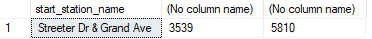

>SELECT TOP 10 start_station_name, COUNT(start_station_name) AS mostusedstartstation  
FROM ONEYEARDATA  
WHERE member_casual = 'casual'  
GROUP BY start_station_name, member_casual  
ORDER BY mostusedstartstation DESC

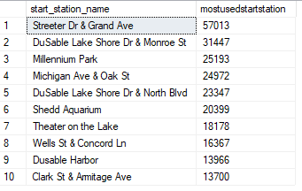

**Streeter Dr & Grand Ave** has the most used start station **(57,013 trips)** which is great to target casual users. We select **top 10 most used starting stations**.

We repeat the same with **end station**, since campaign will also work on both way.

>SELECT TOP 10 end_station_name, COUNT(end_station_name) AS mostusedendstation  
FROM ONEYEARDATA  
WHERE member_casual = 'casual'  
GROUP BY end_station_name, member_casual  
ORDER BY mostusedendstation DESC

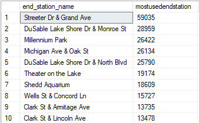

####Case Study Roadmap 5: _SHARE_

Now, we are ready to share our analysis using Tableau visualization tool to give a clearer image to the stakeholders.
In this project, we will determine insights of number of users in a week spreading out whole year, and which location to target the campaign.

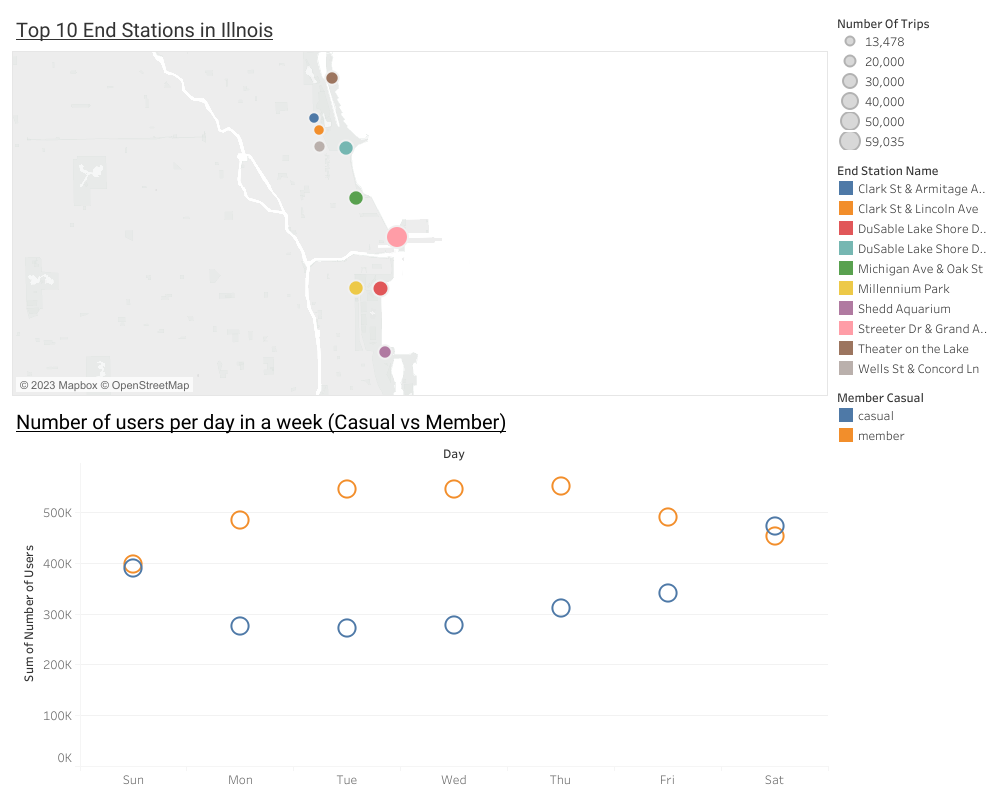

####Case Study Roadmap 6: _ACT_

The trend here is presented and new marketing strategy is created. Some of the suggestions include:

1.) As these bikes are parked at the **top 10 stations** in Illnois, **posters, billboards** should be placed at these locations so that these casual riders will know there is ongoing promotion for signing up the membership.

2.) Weighing the cost of promotion, assuming that there is a certain budget constraint, Cyclistic should utilize these budget instead to **hire more promoters** in these stations, particularly on **Saturday & Sunday** due to large number of casual riders tend to ride in weekend.

3.) Average duration per ride is **19 minutes** which is considered as a tiring trip, where users would look for something to quench their thirst after the ride.  
Hence Cyclistic should utilize this data, perhaps by **collaborating with energy drink company** and provide **free beverages or exclusive membership discount of beverages** if membership is sign up on the spot, targeting at top 10 stations.

###And that concludes the end of project (More to come!)
